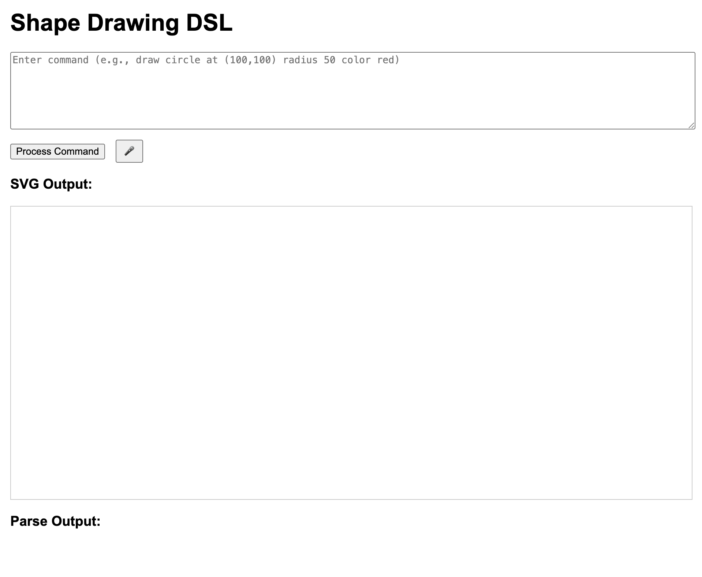
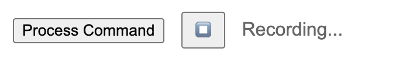
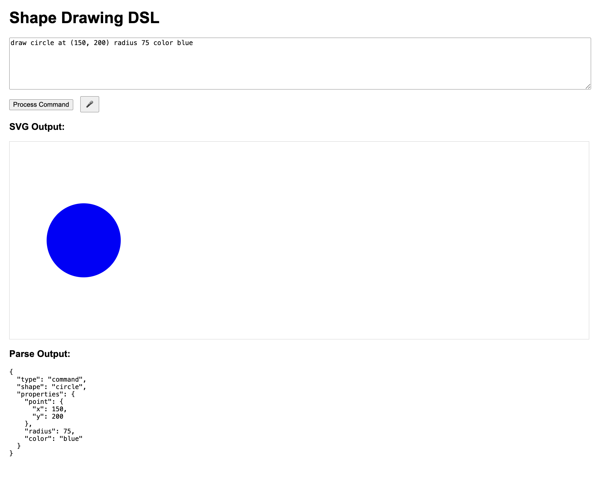
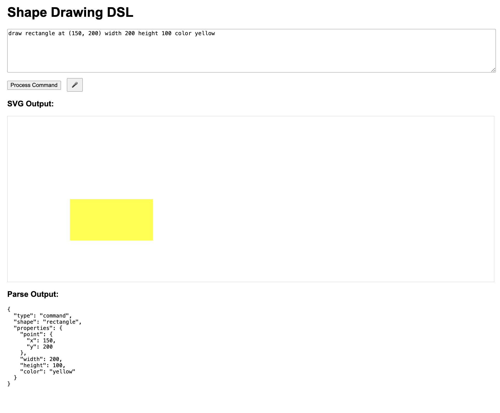
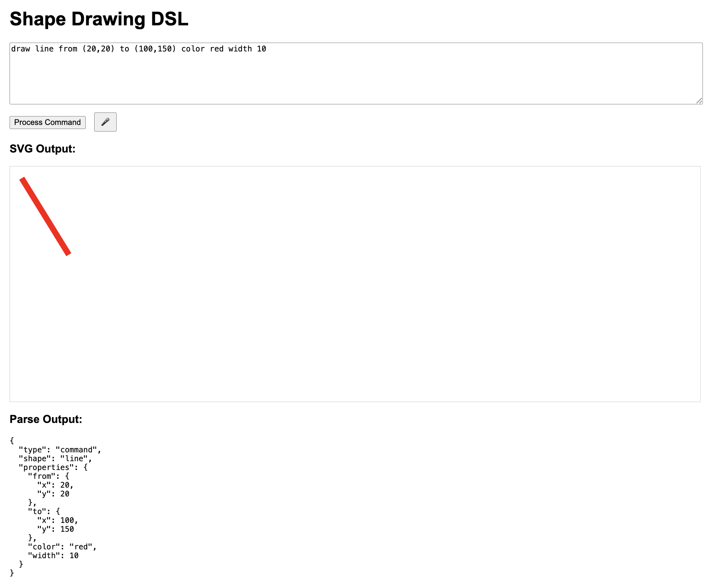
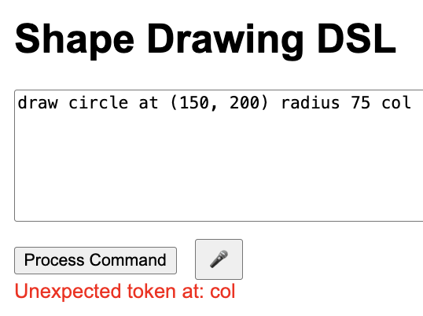
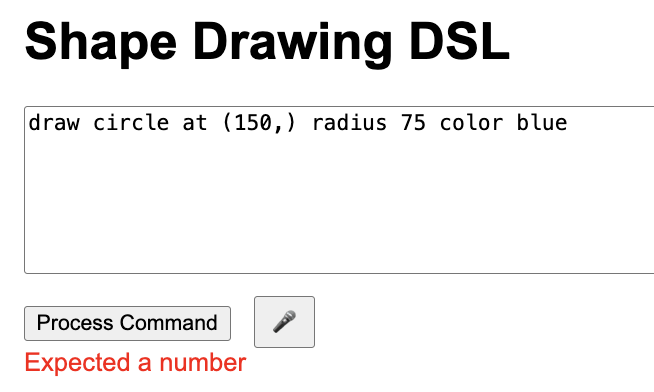
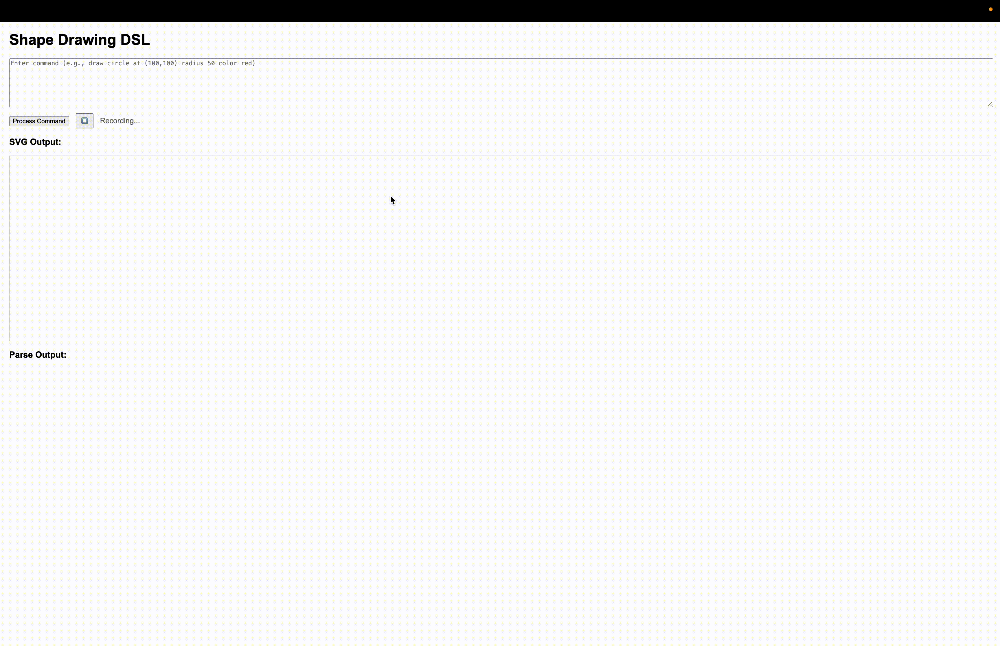
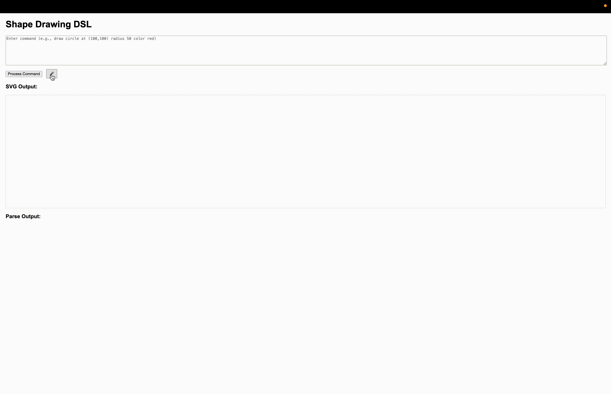

# Shape-DSL

A domain-specific language for drawing simple shapes through text or voice commands.

## Member Responsibilities
- **Menelik Haqq**: Grammar definition, language design, and documentation
- **Nasir Barnes**: Parser implementation, generator, and voice command integration

## Project Overview

### Grammar Definition
The Shape DSL uses a simple grammar for defining drawing commands:
```
<program> ::= <command>
<command> ::= "draw" <shape> <properties>
<shape> ::= "circle" | "rectangle" | "line"
<properties> ::= <circle-properties> | <rectangle-properties> | <line-properties>
<circle-properties> ::= "at" <point> "radius" <number> "color" <color>
<rectangle-properties> ::= "at" <point> "width" <number> "height" <number> "color" <color>
<line-properties> ::= "from" <point> "to" <point> "color" <color> ["width" <number>]
<point> ::= "(" <number> "," <number> ")"
<number> ::= [-]digit+[.digit+]
<color> ::= "red" | "green" | "blue" | "yellow" | "black" | "white" | "purple" | "orange" | "gray" | "pink" | "brown" | "cyan" | "#" hexdigit{6}
```

### Parser Implementation
- Uses recursive descent parsing strategy
- Processes tokens sequentially and builds an abstract syntax tree
- Each grammar rule has its own parsing method
- Provides clear error messages for syntax errors

### Language Design
- **Accessibility**: Accepts natural language through text or voice
- **Simplicity**: Focuses on basic shape drawing with intuitive syntax
- **Error Tolerance**: Extensive preprocessing normalizes varied inputs
- **Minimal Learning Curve**: Commands mirror natural human descriptions

### How to Run the Project

1. Either Clone the repository at https://github.com/nabarnes43/Shape-DSL or Download from Blackboard
2. Open `index.html` in a modern web browser
3. To use voice commands:
   - Configure your API key in `config.js` (copy from `config.example.js`)
   - Click the microphone button and speak your command
   - Click the button again to stop recording
4. To use text commands:
   - Type your command in the text area
   - Click "Process Command"

### Example Command Flow

**Input (Voice)**: "draw a circle at position one hundred fifty, two hundred with radius seventy five color blue"

**Processed Input**: "draw circle at (150, 200) radius 75 color blue"

**Parse Tree Structure**:
```
parse()
└── command()
    ├── consume('KEYWORD', 'draw')
    ├── shape: 'circle'
    └── circleProperties()
        ├── consume('KEYWORD', 'at')
        ├── point()
        │   ├── consume('SYMBOL', '(')
        │   ├── number() → 150
        │   ├── consume('SYMBOL', ',')
        │   ├── number() → 200
        │   └── consume('SYMBOL', ')')
        ├── consume('KEYWORD', 'radius')
        ├── number() → 75
        ├── consume('KEYWORD', 'color')
        └── color() → 'blue'
```

**Abstract Syntax Tree (AST)**:
```javascript
{
  type: 'command',
  shape: 'circle',
  properties: {
    point: { x: 150, y: 200 },
    radius: 75,
    color: 'blue'
  }
}
```

**Generated Output**: A blue circle with radius 75px at position (150,200) on the canvas

## Screenshots

### Main Interface
The application's user interface provides a text input area, process button, and microphone button for voice commands.



### Voice Command Recording
When recording a voice command, the microphone button changes to indicate active recording.



### Circle Example
This shows a circle drawn at coordinates (100,150) with a radius of 50 pixels in red.



### Rectangle Example
A rectangle drawn at coordinates (50,50) with width 100, height 80 in green.



### Line Example
A line drawn from coordinates (20,30) to (200,150) in blue with width 3.



### Error Handling

#### Syntax Error
The system provides clear error messages when syntax doesn't match the expected grammar.



#### Property Error
When required properties are missing or invalid, the system shows specific error messages.



## Demo Videos

Watch our DSL in action:

### Square Example
This demo shows creating a square using our Shape DSL:



For a full demonstration with sound and voice command processing, download the MOV version:
[Square Example with Sound (MOV)](demos/square_example.mov)

### Circle Example
This demo demonstrates drawing a circle using voice and text commands:



For a full demonstration with sound and voice command processing, download the MOV version:
[Circle Example with Sound (MOV)](demos/circle_example.mov)
